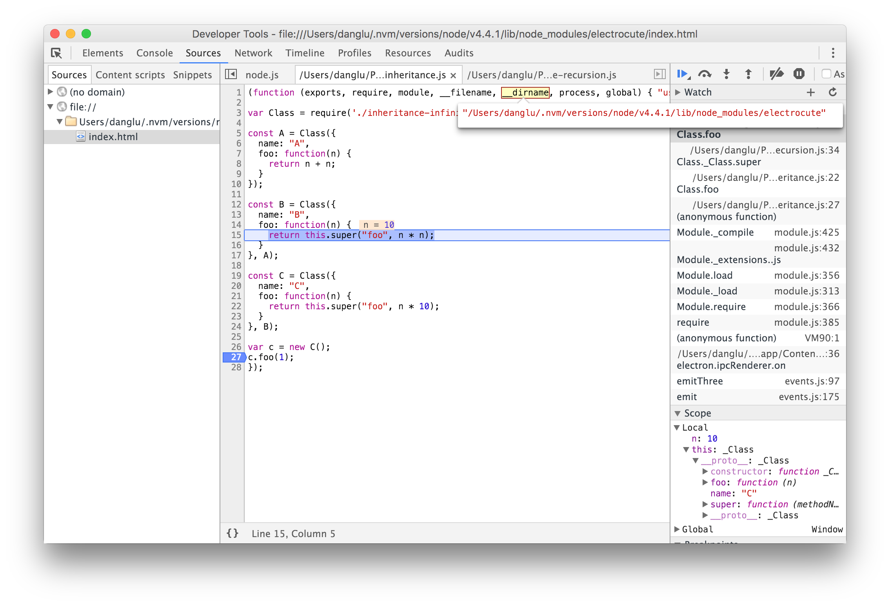
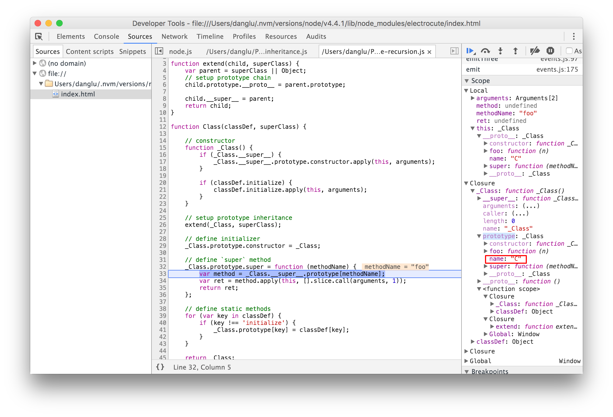
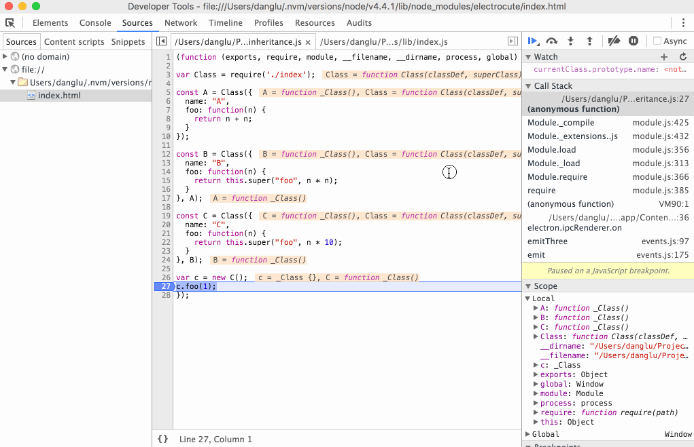

### Super 的无限递归


#### 原因分析

刚开始实现 super 的时候，不免会很直观地实现成这样：

``` js
_Class.prototype.super = function(methodName) {
	var method = _Class.__super__.prototype[methodName];
	var ret = method.apply(this, [].slice.call(arguments, 1));
	return ret;
}
```

这样会造成课中所说的无限递归，为了看调试结果方便，我们下面的测试用例给每个 Class 都加了一个 name 字段做标记。

``` js
const A = Class({
  name: "A",
  foo: function(n) {
    return n + n;
  }
});

const B = Class({
  name: "B",
  foo: function(n) {
    return this.super("foo", n * n);
  }
}, A);

const C = Class({
  name: "C",
  foo: function(n) {
    return this.super("foo", n * 10);
  }
}, B);

var c = new C();
c.foo(1);
```

我们用调试器单步 step into，可以发现调用到 C 中的 this.super 的时候，是可以调用到 B.foo 的：

 

但是继续 step into 下去我们会发现，上面的 `this.super` 其实调用的就是 `C.super.apply(this)`  ，于是我们又会跳到 `B.foo` 这里执行，如此便造成了代码运行的死循环。



#### 解决方法

其实就是要在调用 super 的时候，记录一下当前应该要进入哪个类了，这样我们就可以按图索骥来调用相应类的代码了。我先初步实现了一个版本：


```js
// define `super` method
var currentClass = _Class;  // 记录当前应该要进入哪个类了
_Class.prototype.super = function(methodName) {
    var method = currentClass.__super__.prototype[methodName];
    currentClass = currentClass.__super__;
    var ret = method.apply(this, [].slice.call(arguments, 1));
    return ret;
};
```


看起来是正确的但是会挂在这个测试上：

```shell
$ mocha verify -g "Implement Super's Super"

  Implement Super's Super
    ✓ should be able to call super's super
    1) should be able to call the super method multiple times


  1 passing (14ms)
  1 failing
  
  1) Implement Super's Super should be able to call the super method multiple times:
     TypeError: Cannot read property 'apply' of undefined
      at _Class.Class._Class.super (lib/index.js:36:19)
      at _Class.Class.foo (verify/inheritance_spec.js:141:24)
      at Context.<anonymous> (verify/inheritance_spec.js:154:20)
```

这样的话，调用第一次的时候会把 `currentClass` 一路 set 到 `A` ，污染了下一次调用，所以下一次调用开始的时候是从 `currentClass === A` 开始，必然会报错了。解决方法就是调用结束后把 `currentClass` 重置一下就好了，最终正确的实现应该是：


```javascript
// define `super` method
var currentClass = _Class;
_Class.prototype.super = function(methodName) {
    var method = currentClass.__super__.prototype[methodName];
    currentClass = currentClass.__super__;
    var ret = method.apply(this, [].slice.call(arguments, 1));
    // reset
    currentClass = _Class;
    return ret;
};
```


 