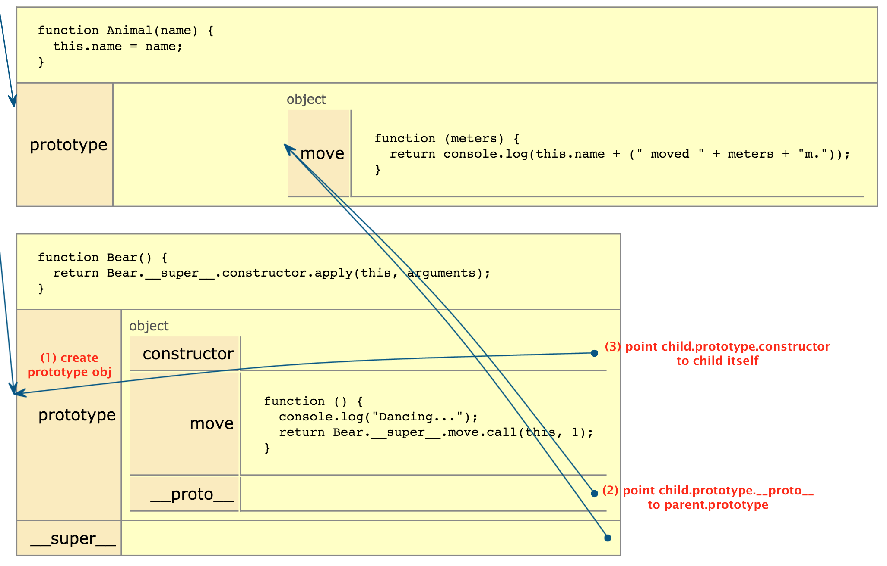

### Prototype Chain

在 javascript 中，一个对象有一个特殊的 `[[Prototype]]` Pointer，指向它所继承的「父类」的 prototype，
目前大部分浏览器都使用 `__proto__` 这个关键字。javascript 的继承就是通过 `__proto__` 串成的链来实现的。
> 下面不做特殊说明的话 `__proto__` 一律指代 `[[Prototype]]`

#### 练习: Prototype Inheritance

```javascript
function A() {
}

A.prototype.a = function() {
  return 1;
};

function B() {
}

B.prototype.b = function() {
  return 2;
};

B.prototype.__proto__ === Object.prototype;  // true
```


### CoffeeScript's Inheritance

```javascript
var hasProp = {}.hasOwnProperty;

var extend = function(child, parent) {
  // Copy static methods
  for (var key in parent) {
    if (hasProp.call(parent, key))
      child[key] = parent[key];
  }

  // Setup prototype inheritance
  // ctor creates child.prototype and setup the prototype chain
  function ctor() {
  	this.constructor = child;  // (3)
  }
  ctor.prototype = parent.prototype;  // (2)
  child.prototype = new ctor();  // (1)

  // Unlike `prototype`, `__super__`  is not a special property.
  // You can ignore it for now.
  child.__super__ = parent.prototype;

  return child;
};
```

这里 (1)-(3) 对应了它们在下图中所标位置所做的事情。 `ctor` 其实充当的是创建 `child.prototype` 和建立原型链的作用。课程中介绍过 prototype 有两个重要属性，一个是 constructor，应该指向 prototype 所属的「类」的构造函数，这里就是 child 本身；另外一个就是 `__proto__`，它应该指向的是所属「类」的「父类」的 prototype，在这里是 parent.prototype。这样我们就把整个原型链串了起来。其实 ctor 开始的这段代码的作用和

```javascript
child.prototype.__proto__ = parent.prototype
child.prototype.constructor = child
```

这段代码所达成的目标是一样的，Coffeescript 之所以饶了个弯子这么做的原因还是 `__proto__` 不是所有的浏览器都支持，因此利用了当一个 object 被创建时，object.[[Prototype]] 会被指向构造函数的 prototype（在上面的例子中是 ctor.prototype(parent.prototype)），而构建了原型链。



完整的图和对应的演示可以在 [这里][js-tutor] 看到。

Q: Why replace child's prototype with new ctor()?

A: Because we have to use ctor to link the prototype chain with parent, and be compatible with all major browsers.

Q: Why set this.constructor in ctor? What if we define ctor as an empty function function ctor() {}?

A: child.prototype.constructor should point to child. If we don't set `this.constructor = child`, say we define ctor as `function ctor(){}`, then `child.prototype.constructor === ctor`, when you call `var c = new child()`, it actually creates an instance of child using function `parent`, which is clearly not what we want(c should be `constructed` by function `child`).

```javascript
var b = new Bear();
Bear.prototype.constructor === Animal  // true
```

Q: How is the child prototype connected to the parent's prototype?

A: See the graph above.


#### 练习：Rewrite extend

```javascript
function extend(child, parent) {
	// copy static methods
	for (var key in parent) {
		if (Object.hasOwnProperty.call(parent, key)) {
			child[key] = parent[key];
		}
	}

	child.prototype.constructor = child;
	// setup prototype chain
	child.prototype.__proto__ = parent.prototype;
	//	Object.defineProperty(child.prototype, '__proto__', {'value': parent.prototype});

	return child;
}

```

### 类型检查

```javascript
function A() {
}

A.prototype.a = function() {
  return 1;
};

function B() {
}

B.prototype.b = function() {
  return 2;
};

extend(B, A);

var b = new B();

// instanceof 就是沿着 instance 的原型链往上找，看看是否等于某个「类」的 prototype
// 只能判断 instance 是否属于某个类或其子类的
b instanceof B;  // true
b instanceof A;  // true

// 由原型链的图可知，对象的 constructor 就是其所属的「类」
// 因此下面的方法判断的是 instance 是否直接属于某个类的
b.constructor === B;  // true
b.constructor === A;  // true
```

instanceof 查找算法

```javascript
function ordinaryHasInstance(C, O) {
  // 4
  let P = C.prototype;

  // 7
  while(true) {
    // 7.a
    O = O.__proto__;

    // 7.c
    if (O === null) {
      return false;
    }

    // 7.d
    if (O == P) {
      return true;
    }
  }
}
```


[js-tutor]: http://www.pythontutor.com/javascript.html#code=var+Animal,+Bear,%0A++extend+%3D+function(child,+parent%29+%7B%0A++++for+(var+key+in+parent%29+%7B%0A++++++if+(hasProp.call(parent,+key%29%29+%7B%0A++++++++child%5Bkey%5D+%3D+parent%5Bkey%5D%3B%0A++++++%7D%0A++++%7D%0A%0A++++//+creates+child.prototype%0A++++function+Ctor(%29+%7B%0A++++++this.constructor+%3D+child%3B%0A++++%7D%0A++++//+because+you+want+to+set+child.prototype.__proto__+%3D+parent.prototype%0A++++Ctor.prototype+%3D+parent.prototype%3B%0A++++//+When+an+instance+of+an+object+is+created,%0A++++//+the+__proto__+property+is+updated+to+point+to+the+constructor%E2%80%99s+prototype%0A++++child.prototype+%3D+new+Ctor(%29%3B%0A++++child.__super__+%3D+parent.prototype%3B%0A++++return+child%3B%0A++%7D,%0A++hasProp+%3D+%7B%7D.hasOwnProperty%3B%0A%0AAnimal+%3D+(function(%29+%7B%0A++function+Animal(name%29+%7B%0A++++this.name+%3D+name%3B%0A++%7D%0A%0A++Animal.prototype.move+%3D+function(meters%29+%7B%0A++++return+console.log(this.name+%2B+(%22+moved+%22+%2B+meters+%2B+%22m.%22%29%29%3B%0A++%7D%3B%0A%0A++return+Animal%3B%0A%0A%7D%29(%29%3B%0A%0ABear+%3D+(function(superClass%29+%7B%0A++extend(Bear,+superClass%29%3B%0A%0A++function+Bear(%29+%7B%0A++++return+Bear.__super__.constructor.apply(this,+arguments%29%3B%0A++%7D%0A%0A++Bear.prototype.move+%3D+function(%29+%7B%0A++++console.log(%22Dancing...%22%29%3B%0A++++return+Bear.__super__.move.call(this,+1%29%3B%0A++%7D%3B%0A%0A++return+Bear%3B%0A%0A%7D%29(Animal%29%3B%0A%0A//+---%0A//+generated+by+coffee-script+1.9.2%0A&mode=display&origin=opt-frontend.js&cumulative=false&heapPrimitives=false&textReferences=false&py=js&rawInputLstJSON=%5B%5D&curInstr=14